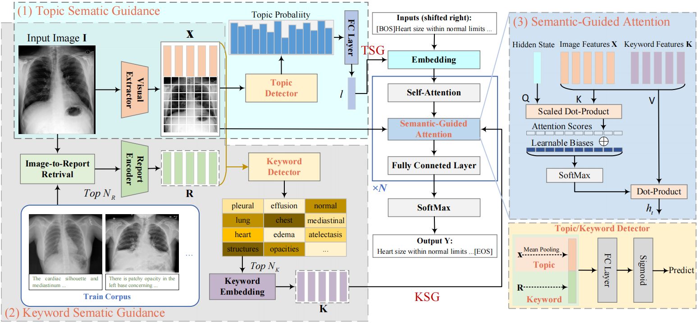

# TKSG

## Abstract

Automated radiology report generation is crucial in clinical practice, yet diagnosing radiological images typically requires 5-10 minutes from physicians, wasting valuable healthcare resources. Existing studies have not fully utilize knowledge from historical radiology reports, lacking sufficient and accurate prior information. To address this, we propose a Topic-Keyword Semantic Guidance (TKSG) framework. This framework uses BiomedCLIP to accurately retrieve historical similar cases. Supported by multimodal, TKSG accurately detects topic words (disease classifications) and keywords (common symptoms) in diagnoses. The probabilities of topic terms are aggregated into a topic vector, serving as global information to guide the entire decoding process. Additionally, a semantic-guided attention module is designed to refine local decoding with keyword content, ensuring report accuracy and relevance. Experimental results show that our model achieves excellent performance on both IU X-Ray and MIMIC-CXR datasets.



## Requirements

- `torch==1.7.1`
- `torchvision==0.8.2`
- `opencv-python==4.4.0.42`
- `transformers==4.35.2`

## Datasets

We use two datasets (IU X-Ray and MIMIC-CXR) in our paper.

For `IU X-Ray`, you can download the dataset from [here](https://drive.google.com/file/d/1c0BXEuDy8Cmm2jfN0YYGkQxFZd2ZIoLg/view?usp=sharing) and then put the files in `data/iu_xray`.

For `MIMIC-CXR`, you can download the dataset from [here](https://drive.google.com/file/d/1DS6NYirOXQf8qYieSVMvqNwuOlgAbM_E/view?usp=sharing) and then put the files in `data/mimic_cxr`. You can apply the dataset [here](https://drive.google.com/file/d/1DS6NYirOXQf8qYieSVMvqNwuOlgAbM_E/view?usp=sharing) with your license of [PhysioNet](https://physionet.org/content/mimic-cxr-jpg/2.0.0/).

NOTE: The `IU X-Ray` dataset is of small size, and thus the variance of the results is large.
There have been some works using `MIMIC-CXR` only and treating the whole `IU X-Ray` dataset as an extra test set.

## Image-to-Report Retrieval

We used `BiomedCLIP` to retrieve similar historical cases with the following environment configuration:

```
pip install transformers==4.35.2 -i https://pypi.mirrors.ustc.edu.cn/simple
```

```
HF_ENDPOINT=https://hf-mirror.com python BiomedCLIP_extract_image.py 
```

More detailed information on `BiomedCLIP` can be found at https://github.com/mlfoundations/open_clip

For the convenience of future research and reproducibility, we also provide the results retrieved using `CLIP`, `MedCLIP`, and `BiomedCLIP` for [similar historical cases]().

## Pseudo Label Generation 

You can generate the pesudo label for each dataset by leveraging the automatic labeler [ChexBert](https://github.com/stanfordmlgroup/CheXbert).

For the convenience of future research and reproducibility, we also provide the [generated labels]().

## Train

Run `bash train_iu_xray.sh` to train a model on the IU X-Ray data.

Run `bash train_mimic_cxr.sh` to train a model on the MIMIC-CXR data.

## Test

Run `bash test_iu_xray.sh` to test a model on the IU X-Ray data.

Run `bash test_mimic_cxr.sh` to test a model on the MIMIC-CXR data.

Follow [CheXpert](https://github.com/MIT-LCP/mimic-cxr/tree/master/txt/chexpert) or [CheXbert](https://github.com/stanfordmlgroup/CheXbert) to extract the labels and then run `python compute_ce.py`. Note that there are several steps that might accumulate the errors for the computation, e.g., the labelling error and the label conversion. We refer the readers to those new metrics, e.g., [RadGraph](https://github.com/jbdel/rrg_emnlp) and [RadCliQ](https://github.com/rajpurkarlab/CXR-Report-Metric).
